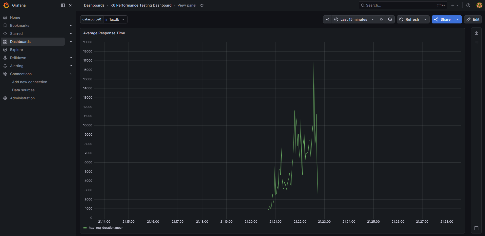
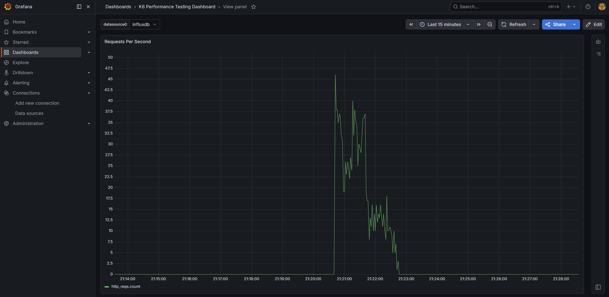
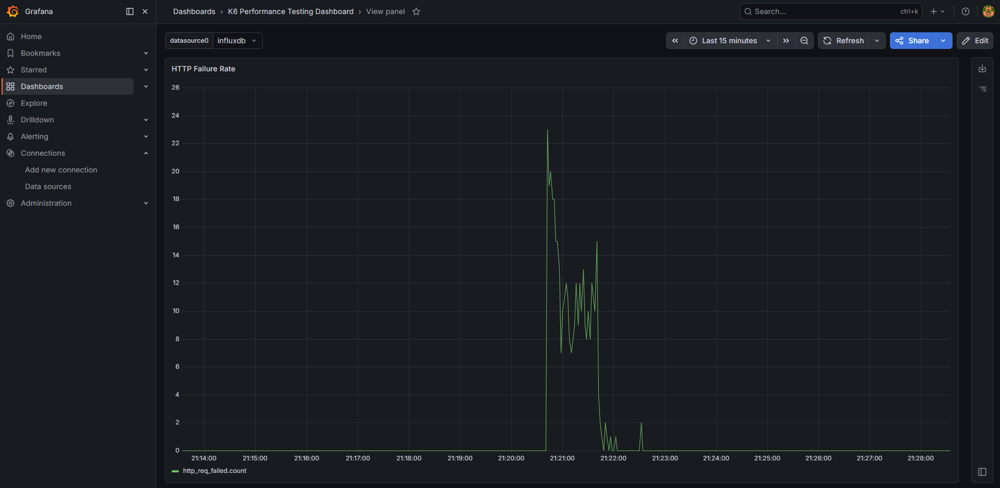
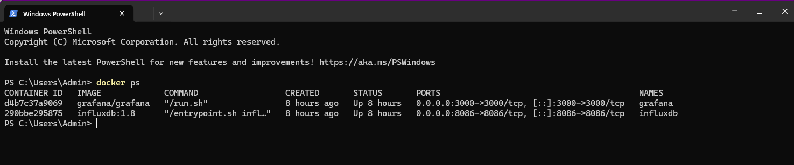
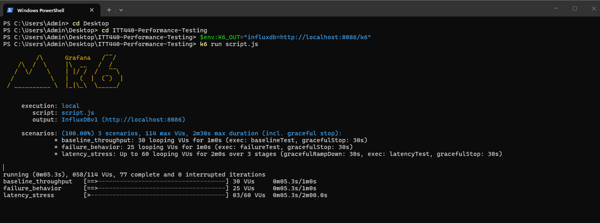
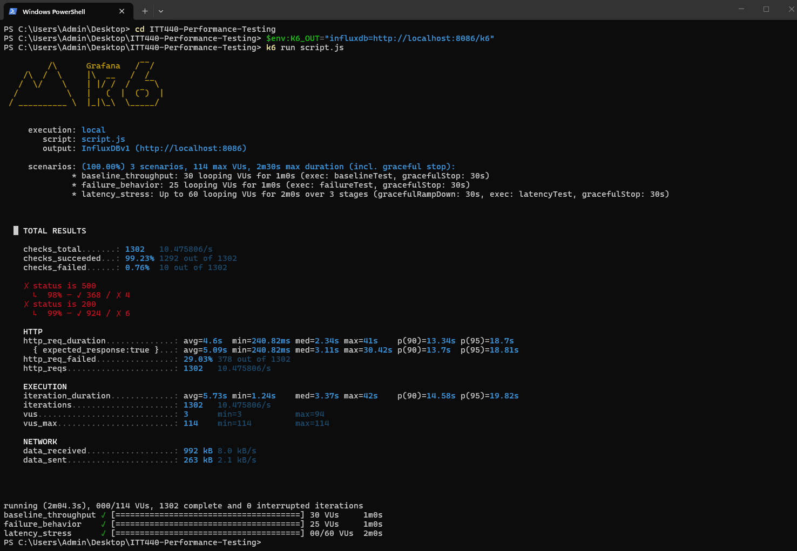
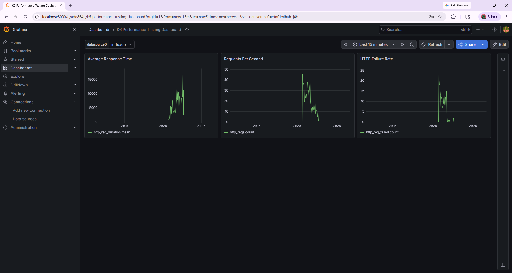

# MOHAMAD AIMAN FAIZ BIN MAZLAN

---

# 🚀 Performance Evaluation of HTTP Response Behavior Under Concurrent Load Using k6

---

## 🎓 ITT440 – Network Programming (Individual Assignment)

| Item | Details |
|------|--------|
| **Name** | MOHAMAD AIMAN FAIZ BIN MAZLAN |
| **Student No** | 2024369211 |
| **Course** | ITT440 – Network Programming |
| **Target API** | https://httpbin.org/ |
| **Tools Used** | k6, Grafana, InfluxDB, Docker |

---

# 1. Project Overview

This project evaluates the performance behavior of a public API under different levels of concurrent user load using the **k6 performance testing tool**.

The objective is not only to verify API functionality, but to analyze how the system behaves under normal, stress, and failure conditions.

All performance metrics are collected using **InfluxDB** and visualized through **Grafana dashboards**.

---

# 2. Problem Statement

Modern APIs must handle concurrent requests efficiently.

However, under increasing traffic, systems may experience:

- Increased response time  
- Reduced throughput  
- Higher error rates  
- Performance instability  

This project investigates these behaviors through structured performance testing.

---

# 3. Objectives

- Evaluate HTTP response performance under concurrent load  
- Measure response time and throughput  
- Identify performance bottlenecks  
- Analyze system stability under stress  
- Visualize performance metrics using Grafana  

---

# 4. Tools Used

- **k6** → Performance testing engine
  


  
- **Grafana** → Data visualization
  


  
- **InfluxDB** → Metrics storage
  


  
- **Docker** → Container environment
  


  
- **httpbin.org** → Public API test target  

---

# 5. System Architecture

```
k6 → httpbin API → InfluxDB → Grafana
```

This pipeline enables real-time monitoring of test execution results.

---

# 6. Test Scenarios

## 🟢 Baseline Throughput Test

- Endpoint: `/get`  
- Virtual Users: 30  
- Duration: 1 minute  

### Purpose
To measure normal API performance under expected traffic conditions.

### Observation
- Stable response time  
- No request failures  
- Consistent throughput  

📸 Evidence  


---

## 🟠 Latency Stress Test

- Endpoint: `/delay/2`  
- Virtual Users: 0 → 60  
- Duration: 2 minutes  

### Purpose
To simulate delayed responses and increasing concurrent load.

### Observation
- Response time increases under load  
- Latency spikes observed at higher VUs  
- System remains stable  

📸 Evidence  


---

## 🔴 Failure Behavior Test

- Endpoint: `/status/500`  
- Virtual Users: 25  
- Duration: 1 minute  

### Purpose
To evaluate system behavior under server error conditions.

### Observation
- HTTP 500 responses handled correctly  
- No system crash observed  
- System remains stable under error load  

📸 Evidence  


---

# 7. How to Run the Test

```bash
$env:K6_OUT="influxdb=http://localhost:8086/k6"
k6 run script.js
```

All scenarios are already configured inside [**`script.js`**](script.js).

---

# 8. k6 Script Summary

The test script includes 3 scenarios:
- Baseline Throughput Test  
- Latency Stress Test  
- Failure Behavior Test  

Each scenario simulates real-world API traffic conditions under different load patterns.

---

# 9. Results Summary

| Test | Observation |
|------|-------------|
| 🟢 Baseline | Stable performance with no failures |
| 🟠 Latency | Increased response time under load |
| 🔴 Failure | Proper HTTP 500 error handling |

---

# 10. Key Findings

- The API remains stable under normal load
- Performance degradation occurs under stress conditions
- Latency spikes are observed at higher concurrency levels
- No system crash or breakdown detected
- The system handled up to 60 concurrent virtual users successfully

---

# 11. Issues Observed

- Response time inconsistency under load  
- Latency spikes during stress execution  
- No clear system breaking point identified within test range  

---

# 12. Recommendations

- Implement caching to reduce response latency  
- Improve backend processing efficiency
- Introduce load balancing for scalability
- Apply rate limiting for traffic spikes
- Extend testing beyond 60 virtual users for deeper analysis

---

# 13. System Evidence (Execution Proof)

## 🐳 Docker Containers Running


Both InfluxDB and Grafana services are running successfully.

---

## ⚡ k6 Execution Output



Confirms successful execution of all three test scenarios.

---

## 📊 Grafana Dashboard Overview


Displays real-time system metrics:
- Response time
- Request rate
- Error rate
- Virtual users (VUs)

---

## 🔁 Retest Evidence


Shows consistency of results across multiple executions.

---

# 14. Conclusion

This project demonstrates that API performance evaluation goes beyond functional testing.

> Even when an API responds correctly, performance bottlenecks may still appear under concurrent load.

The main limitation observed in this study is increased latency under stress conditions, rather than system failure.

---

# 15. Video Demonstration

👉 https://youtube.com/

---

# ⭐ Final Note

This project integrates key performance engineering tools:
- k6 for load testing
- Grafana for visualization
- InfluxDB for metrics storage
- Docker for environment setup

All results are based on real-time execution against a live public API.
