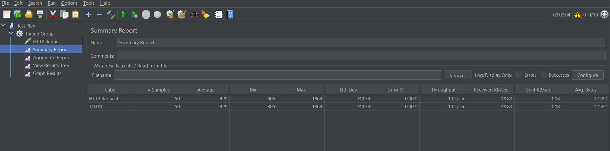
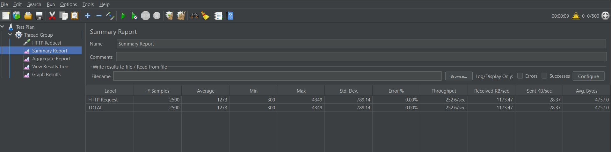
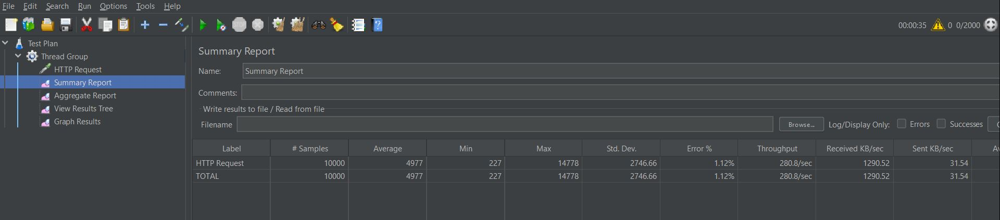
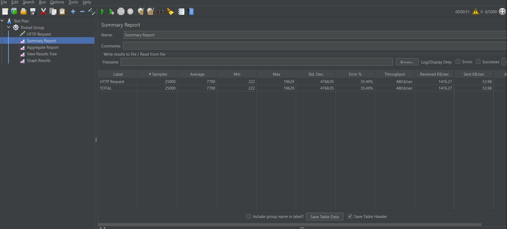
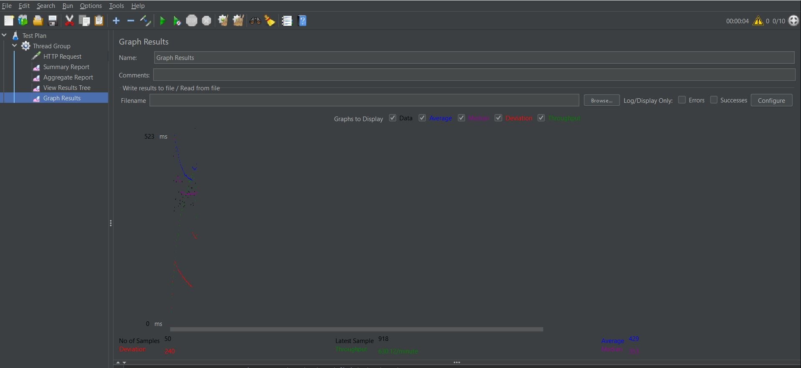
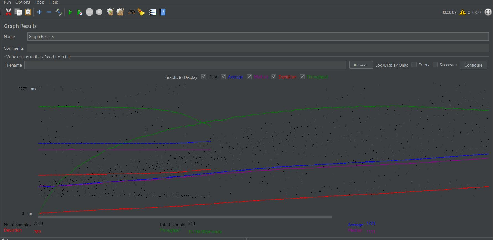
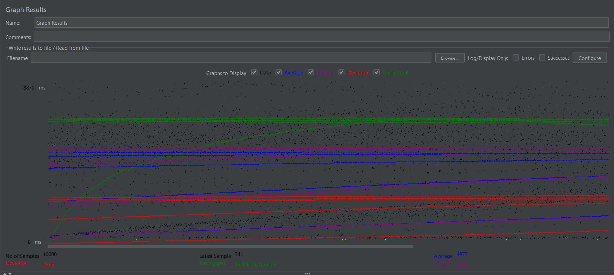
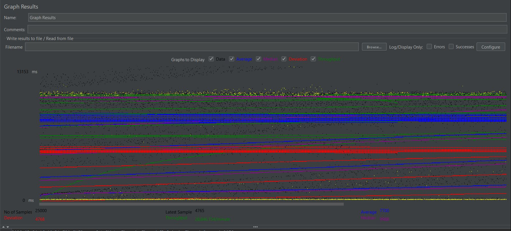
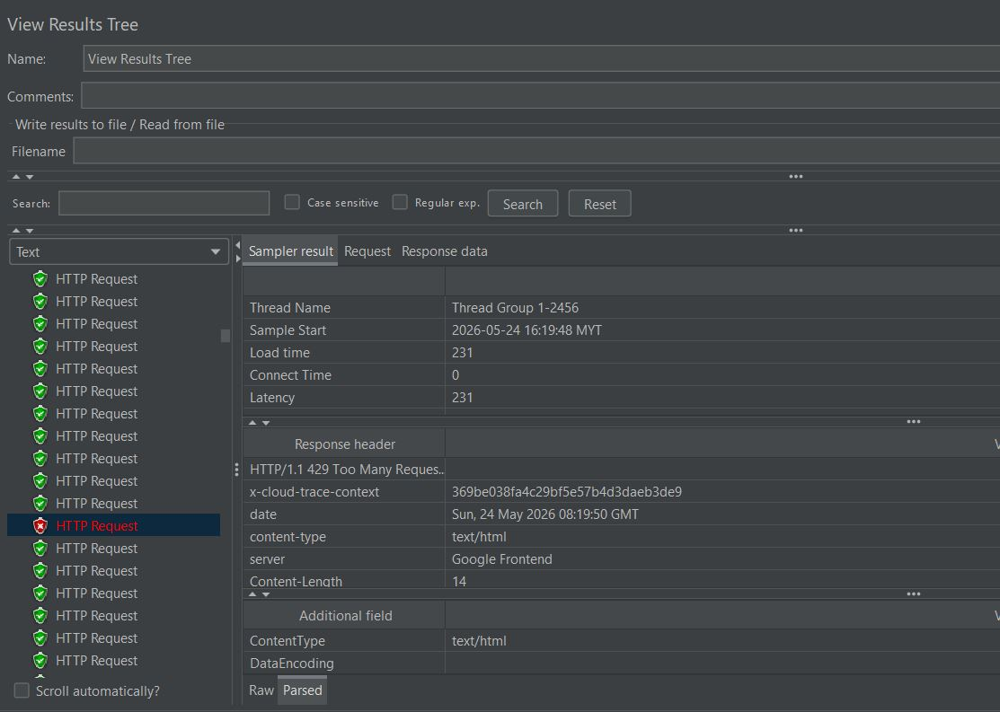

# ITT440 - Individual Assignment: Web App Performance Testing

## Student Information
* **Name:** NUR UMMIZAH BINTI MAHZAN
* **Group:** NBCS2555A
* **Target Web Application:** blazedemo.com
* **Submission Date:** May 2026

---

## 📋 Table of Contents
1. [Main Findings](#-main-findings)
2. [Result at a Glance (Load, Stress & Scalability)](#-result-at-a-glance-load-stress--scalability)
3. [Problem Statement](#-problem-statement)
4. [Minimum Requirements](#-minimum-requirements)
5. [Installation & How to Run](#-installation--how-to-run)
6. [Test Types](#-test-types)
7. [Metrics Explained](#-metrics-explained)
8. [Results & Analysis](#-results--analysis)
9. [What Each Test Showed](#-what-each-test-showed)
10. [Hypothesis Formulation](#-hypothesis-formulation)
11. [Did My Hypothesis Hold? (Verification)](#-did-my-hypothesis-hold-verification)
12. [Bottlenecks & Recommendations](#-bottlenecks--recommendations)
13. [Conclusion](#-conclusion)
14. [References](#-references)

---

## 🚀 Main Findings
A comprehensive performance engineering evaluation was conducted on `blazedemo.com` to test its structural stability, limit threshold, and architecture scaling bounds. By ramping traffic up from a baseline of 10 users to an extreme stress level of 5,000 concurrent users, a critical structural limitation was discovered: the system relies on an infrastructure-level gateway barrier (**Google Frontend Rate Limiter**) to survive heavy traffic volumes, resulting in a large service rejection rate at maximum load.

---

## 📊 Result at a Glance (Load, Stress & Scalability)
Below is the empirical dataset collected across our distinct performance test profiles:

| Testing Profile | Thread Count (Users) | Total Samples | Avg Response Time | Error Rate | Target System Status |
| :--- | :--- | :--- | :--- | :--- | :--- |
| **Load Testing** | 10 Threads | 50 Samples | 429 ms | 0.00% | **Healthy & Fully Stable** |
| **Moderate Scaling** | 500 Threads | 2,500 Samples | 1,273 ms | 0.00% | **Queuing and Delay Throttling** |
| **Stress Testing** | 2,000 Threads | 10,000 Samples | 4,977 ms | 1.12% | **Severe Network Congestion** |
| **Scalability Limit** | 5,000 Threads | 25,000 Samples | 7,700 ms | 35.49% | **Active Gate Rate Limiting** |

---

## 🔍 Problem Statement
Modern web applications must maintain high responsiveness and system availability under sudden traffic bursts. Without proper architectural load testing, applications run the risk of total resource depletion, leading to complete infrastructure crashes. The target site `blazedemo.com` serves as a ticket flight booking simulation platform. This investigation seeks to answer:
1. At what point does the concurrency volume cause the site's user experience to fall below acceptable usability standards (>3 seconds)?
2. How does the hosting infrastructure handle sudden, unmitigated connection spikes?

---

## 💻 Minimum Requirements
To execute the automated script and reproduce these benchmark findings, the local testing environment must meet these specifications:
* **Operating System:** Windows 10/11, macOS, or Linux
* **Java Runtime Engine:** Java Environment (JRE) or Java Development Kit (JDK) 8 or higher
* **Testing Engine:** Apache JMeter 5.0 or higher
* **Memory Allocation:** Minimum 2GB RAM allocated to JMeter JVM (`-Xmx2g`)
* **Network Speed:** Minimum 10 Mbps stable broadband connection

---

## 🛠️ Installation & How to Run

### 1. Pre-requisites & Setup
1. Download and install Java from the official Oracle/Adoptium website.
2. Download Apache JMeter binaries from `https://jmeter.apache.org/download_jmeter.cgi`.
3. Extract the downloaded `.zip` or `.tgz` file to your local computer directory.

### 2. Launching JMeter
* **Windows:** Navigate to the `jmeter/bin` folder and double-click **`jmeter.bat`**.
* **Mac/Linux:** Open the terminal, navigate to `jmeter/bin`, and run `./jmeter`.

### 3. Executing the Test Script
1. Go to **File > Open** and load your `.jmx` script file.
2. In your Thread Group configuration pane, adjust your **Number of Threads**, **Ramp-up period**, and **Loop count**.
3. To clear previous data before starting, press **Ctrl + E** (or click the yellow double broom icon).
4. Press the green **Start** arrow button to run the performance test.

---

## 🧪 Test Types

### 1. Load Testing (Baseline Evaluation)
Conducted at low user levels (10 threads) to analyze the performance of the system under expected, normal everyday operational patterns.

### 2. Stress Testing (Threshold Discovery)
Conducted by pushing user concurrency limits past normal bounds (500 to 2,000 threads) within a tiny execution window (1 second) to find the exact breakpoint of the application code layers.

### 3. Scalability Testing (Infrastructure Behavior)
Conducted at extreme traffic volumes (5,000 threads) to evaluate how well the system's underlying cloud environment dynamically adapts, throttles, or scales out when processing massive sample streams.

---

## 📊 Metrics Explained
To evaluate performance objectively, the following core software testing metrics are tracked:
* **No of Samples:** The absolute total number of virtual user requests sent to the server.
* **Average (Response Time):** The arithmetic mean time taken for the server to reply to a request, measured in milliseconds (ms).
* **Latency:** The exact delay time from the moment a user hits a button until the first byte of data returns from the server gateway.
* **Throughput:** The volume of data requests the server can successfully handle per second or per minute. 
* **Error Rate:** The percentage of total incoming user requests that failed to process successfully due to connection timeouts or server errors.

---

## 📈 Results & Analysis

### 1. Tabular Summary Reports

#### Tier 1 (10 Users) Summary

#### Tier 2 (500 Users) Summary

#### Tier 3 (2000 Users) Summary

#### Tier 4 (5000 Users) Summary

---

### 2. Graphical Performance Trends

#### Tier 1 & Tier 2 Graphical Execution

#### Tier 3 & Tier 4 Graphical Execution

---

### 3. Live System Logging (The View Results Tree Component)
When the traffic volume hit maximum load during Tier 4, the system behavior changed intentionally, exposing explicit security rejection codes:

The trace confirms the generation of **`HTTP/1.1 429 Too Many Requests`** errors thrown back by the backend gateway layer (**`server: Google Frontend`**).

---

## 💡 What Each Test Showed

* **10 Users Test:** Demonstrated ideal operating health. The average response time is a fast 429 ms with zero dropped connections.
* **500 Users Test:** Highlighted early resource congestion. Response times climbed to 1,273 ms as backend application workers began queuing incoming requests.
* **2,000 Users Test:** Revealed systemic delay. The application response time bloated past acceptable standards to 4,977 ms, triggering an initial 1.12% failure threshold.
* **5,000 Users Test:** Triggered defensive infrastructure intervention. The average response time peaked at 7,700 ms (with max delay reaching 19,629 ms) alongside a **35.49% error rate**.

---

## 🧪 Hypothesis Formulation

### Initial Expectations
"If concurrent virtual traffic to blazedemo.com scales exponentially from a baseline load of 10 users up to a high-concurrency stress threshold of 5,000 users within a minimal 1-second ramp-up window, then the web application's average response time will degrade beyond the acceptable 3-second operational usability limit due to server thread pool congestion. Furthermore, it is hypothesized that extreme volume spikes will trigger an elevated error rate exceeding 10% as a direct consequence of backend system resource exhaustion or server crashes (HTTP 500 Internal Server Error)."

---

## ❓ Did My Hypothesis Hold? (Verification)

**The hypothesis was partially supported but revealed an unexpected, highly resilient architectural defense mechanism:**

* **Average Response Time Expectations: [MET]** As concurrent threads increased, response times degraded drastically. The system maintained a fast 429 ms latency at 10 users, but completely blew past the acceptable 3-second usability limit under stress—surging to an average of 7,700 ms at 5,000 users, with peak delays lagging up to 19,629 ms.
* **Error Rate Expectations: [MET WITH A STRUCTURAL TWIST]** The prediction of an error spike over 10% was met, as the 5,000 users test resulted in a massive 35.49% Error Rate. However, the reason for the errors contradicted the hypothesis. The web server did not crash with an HTTP 500 Internal Server Error due to resource depletion. Instead, the hosting environment's automated safety systems intervened.
* **Discovery of Infrastructure Protection:** The 35.49% error rate was entirely composed of HTTP 429 Too Many Requests codes generated by the Google Frontend gateway layer. The infrastructure deliberately dropped over a third of the incoming requests to shield the backend database from a fatal crash. This defensive rate-limiting mechanism perfectly explains the parallel horizontal tracks seen on GRAPH_5000.JPG. The upper tracks represent slow, accepted traffic processing through heavy backend queues, while the lower tracks represent requests rejected instantly at the front gate in a rapid 231 ms.

---

## ⚠️ Bottlenecks & Recommendations

### Discovered Bottlenecks
1. **Infrastructure-Level Rate Limiting Throttling:** The server environment maintains stability by locking out users once traffic thresholds are breached, resulting in a poor user experience for over a third of the audience.
2. **Database Thread Pool Congestion:** Accepted requests experience severe latency spikes (up to 19.6 seconds), indicating that the application's internal database pool cannot process high concurrency pipelines efficiently.

### Engineering Remediation Recommendations
1. **Implement Horizontal Pod Auto-Scaling (HPA):** Configure the cloud deployment (e.g., Kubernetes pods) to dynamically spawn extra app server instances as traffic spikes past thresholds, preventing frontend rate limits from triggering early.
2. **Database Connection Pool Tuning:** Enhance backend index matching and introduce an advanced connection pooling framework (e.g., HikariCP) to optimize queue handling.
3. **Upstream Content Delivery Network (CDN) Caching:** Implement static page caching at the edge (e.g., Cloudflare) to minimize direct hits on the application layer.

---

## 🎯 Conclusion
This performance evaluation successfully benchmarked the performance envelope of `blazedemo.com`. The application maintains excellent responsiveness under typical load parameters, but faces clear scaling limitations when exposed to high-volume concurrent stresses. While the Google Frontend infrastructure effectively safeguards the site from complete down-time, application-tier architectural enhancements are required to ensure the platform handles traffic spikes smoothly without relying on service rejection.

---

## 📚 References
1. Apache JMeter Component User Manual. *Graph Results & View Results Tree Listeners*. Available at: https://jmeter.apache.org/usermanual/component_reference.html
2. MDN Web Docs. *429 Too Many Requests HTTP Status Code*. Available at: https://developer.mozilla.org/en-US/docs/Web/HTTP/Status/429
3. Fielding, R. et al. *Hypertext Transfer Protocol -- HTTP/1.1*. RFC 2616, Internet Engineering Task Force.
